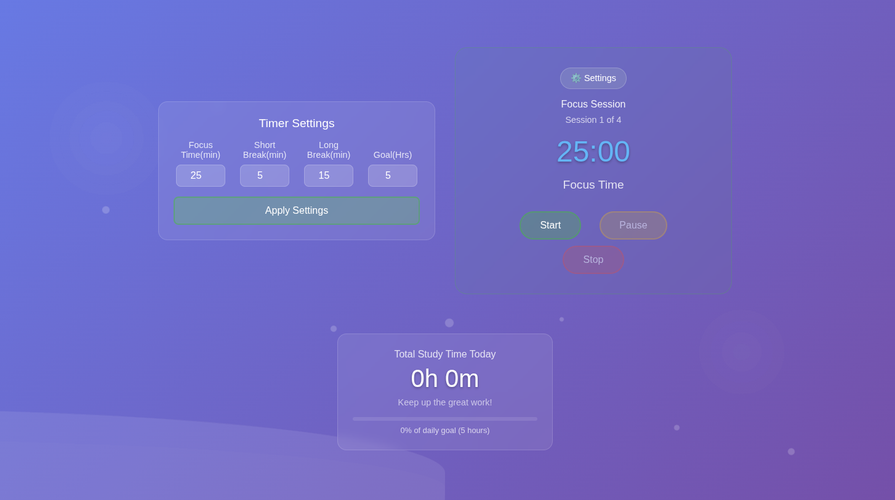

# ⏱️ Focus Timer App (vibe coding rocks 🤘)

A clean and customizable productivity timer based on the Pomodoro technique. This web app helps you structure your work sessions with configurable focus and break times, session tracking, and progress monitoring toward a daily goal — all in a smooth, user-friendly interface.

## 🚀 Features

- 🎯 Set your own Focus, Short Break, and Long Break durations
- 🔁 Automatically switches between sessions and breaks
- 📊 Daily goal tracker with progress percentage display
- 🔔 Audio notifications when sessions start and end
- 💾 Session data is saved using `localStorage` so it survives page reloads
- 📱 Fully responsive design for desktops, tablets, and phones
- 🎨 Simple and clean UI with a light/dark session indicator

## 🛠️ Built With

- **HTML5**
- **CSS3**
- **JavaScript (ES6)**
- **jQuery**
- **LocalStorage** (for persistence across reloads)

## 📦 Getting Started (Run Locally)

To test or modify the app on your local machine:

```bash
git clone https://github.com/arukaka/timer-app.git
cd timer-app
# Then open index.html in your browser
```
## 🌐 Live Demo

Check out the live version here:

🔗 [https://arukaka.github.io/timer-app](https://arukaka.github.io/timer-app)

<!-- Update the above link after GitHub Pages is set up -->

---

## 📸 Screenshots



---

## 📄 License

Apache License 2.0  
This project is open-source and free to use. Feel free to modify it for personal or educational purposes.

---

## 🙌 Author

**Arya Kulkarni**  
[GitHub – @arukaka](https://github.com/arukaka)
